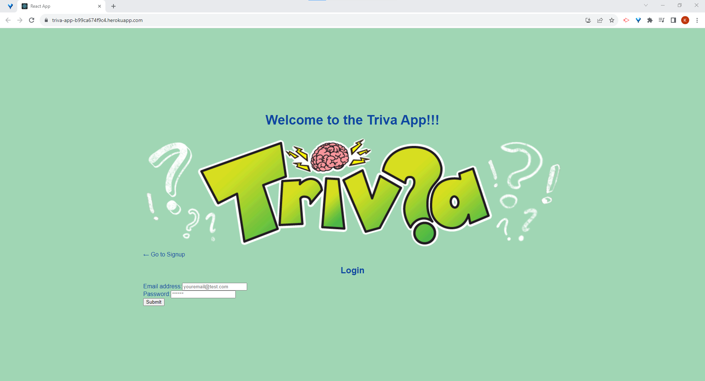

 

# **https://github.com/KMitch137/triva_app**  
### Created by:  
### Kevin, Keir, Damion, Luis  
_________________________
### Table of Contents
  - [Description](#description)
  - [Installation Instructions](#installation-instructions)
  - [How to use this program](#how-to-use-this-program)
  - [Contributions](#contributions)
  - [Testing](#testing)
  - [License](#license)
  - [Questions](#questions)

## **Description:**  
Have you ever been stuck in an elevator? Wanting something else to do other than hear yet another idea from a stranger? Well next time whip your phone out and play some trivia, on the Triva app.  

## **Installation Instructions:**     
You can copy the source files from GitHub listed below or use the app on Heroku  
  

## **How to use this program:**  
The purpose of this project is to end boredom and keep the brain sharp.  

## **Contributions:**  
please submit a pull request.  

## **Testing:**  
there are no tests  

## **License:**  

## Questions:  
EMAIL: [kmitch137@gmail.com, bradshawkeir@gmail.com, lpardo1989@gmail.com, damiongallarza@gmail.com](mailto:kmitch137@gmail.com, bradshawkeir@gmail.com, lpardo1989@gmail.com, damiongallarza@gmail.com)  
GitHub: [KMitch137](https://github.com/KMitch137)
  